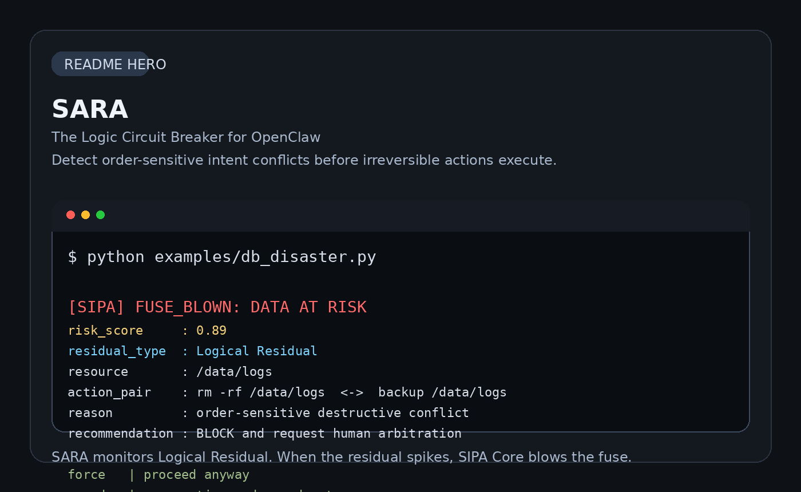

# SARA
*SARA: Safe Action Residual Arbiter* 

The Logic Circuit Breaker for AI Agents. Stop agent implosions before they happen.



SARA is a "pre-execution" logic auditing plugin designed exclusively for high-authority AI agents. Through its built-in **SIPA Core (Sequential Intent & Planning Auditor)** engine, it monitors **Logical Residual** in the instruction stream in real time.

Before an Agent performs any irreversible action (such as database deletion, message sending, or permission modification), SARA previews the divergent consequences of different execution sequences. Once systemic risks caused by intent conflicts or role drift are detected, SARA will immediately trigger a **logic fuse** to protect the underlying system from "semantic pollution" and crashes resulting from complex interactions.

# 🚀 Key Features
- **Logic Circuit Breaking**:Intercept mutually exclusive instructions with high order sensitivity in real time to prevent the Agent from falling into an infinite loop or executing incorrect paths.
- **Sequential Audit**: Based on the SIPA Core engine, calculate the algebraic residuals of intent flows in the state space to quantitatively evaluate collaboration conflicts.
- **Collision Detection**: Automatically identify write conflicts for the same physical resource or logical lock in a multi-user/multi-Agent environment.
- **OpenClaw Optimized**: Deeply adapt the OpenClaw plug-in hooks and support one-click mounting of the ```security.trust_model``` enhancement package.
- **MAS-Agnostic**: Decoupled design of the core audit engine, enabling easy integration with CrewAI, AutoGPT, or any LangGraph-based multi-agent orchestration framework.

---

# 🧠 The Math

The core of SARA is to compute the **Logical Residual** ($R_{logic}$), which predicts the non-commutativity of two actions $A$ and $B$ under a given context $s$.

$$R_{logic} = \| \Phi(s, A, B) - \Phi(s, B, A) \|$$

When the $R_{logic}$ value exceeds the dynamic threshold, the system determines a "logical out-of-control warning" and forcibly enters the manual arbitration mode.

---


